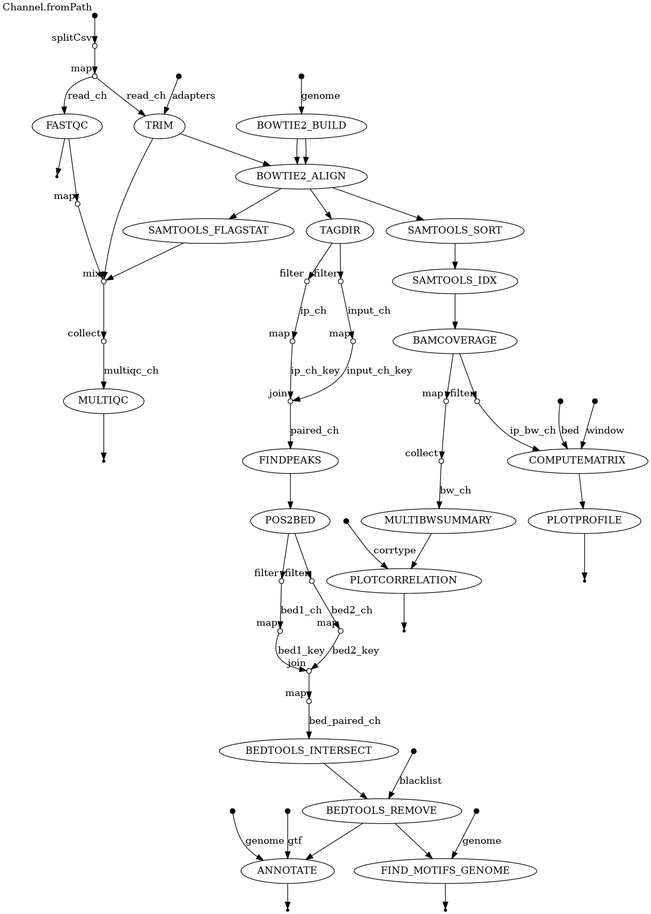
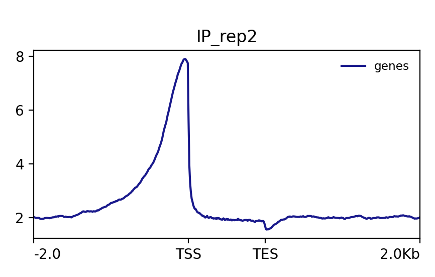
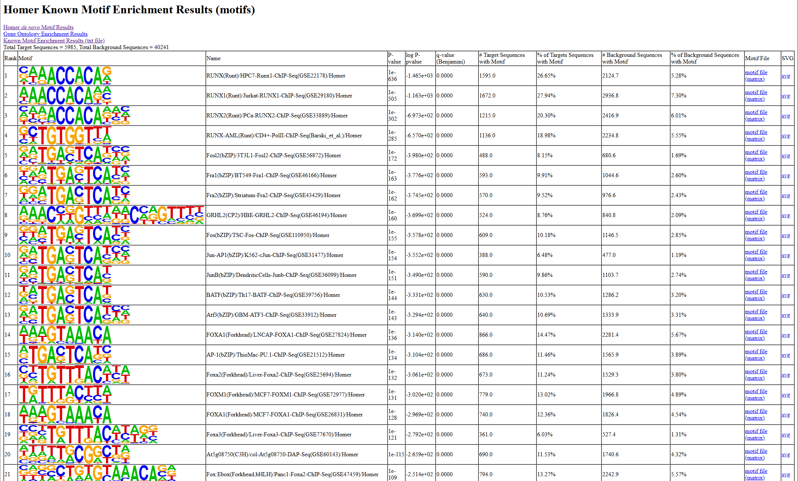
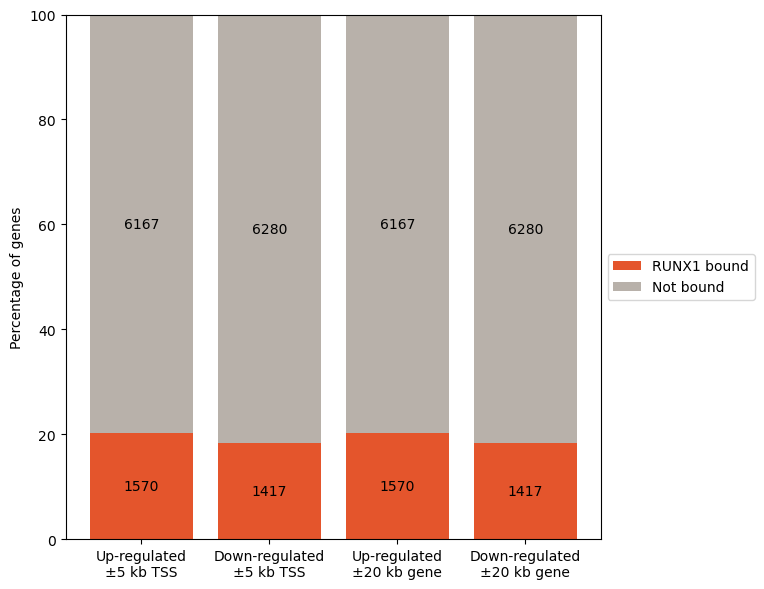
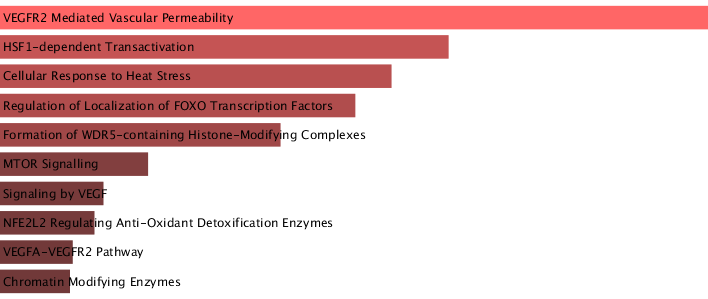

# RUNX1 ChIP-seq Analysis

## Overview
Implemented a reproducible Nextflow DSL2 ChIP-seq pipeline to identify genome-wide RUNX1 binding sites in breast cancer cells (GEO: GSE75070). 

The workflow performs quality control, alignment, peak calling, reproducibility filtering, motif enrichment, and integration with RNA-seq differential expression data.

## Biological Question
Does RUNX1 function as an architectural transcription factor by regulating promoter-proximal regions and influencing chromatin organization in breast cancer?

## Dataset
- Accession: GSE75070
- Organism: Human (hg38)
- Samples:
    - RUNX1 ChIP Rep1
    - RUNX1 ChIP Rep2
    - INPUT Rep1
    - INPUT Rep2
- Single-end sequencing

## Workflow

FASTQC → Trimming → Bowtie2 Alignment →
Samtools Sorting/Indexing →
DeepTools Coverage & Correlation →
HOMER Peak Calling →
Reproducible Peak Intersection (BEDtools) →
Motif Enrichment →
RNA-seq Integration →
Pathway Enrichment (Enrichr)

Implemented using Nextflow DSL2 modular processes.

## Quality Control
- 27–28M mapped reads (ChIP samples)
- ~10M mapped reads (INPUT_rep2)
- Phred scores > 30
- Strong IP enrichment over INPUT
- High replicate correlation

Data quality sufficient for downstream analysis.

## Key Results
### Reproducible Peaks

- 6,015 reproducible RUNX1 peaks
- Promoter-enriched binding profile
- Strong signal at TSS regions

### Motif Enrichment

- RUNX family motifs (dominant)
- YY1
- FOXA family

Indicates cooperative binding with architectural regulators.

### RNA-seq Integration

- ~20% of DE genes overlapped RUNX1 peaks
- Higher than original study (8–10%)
- Likely due to less stringent reproducibility filtering and hg38 reference usage

### Pathway Enrichment

- Significant enrichment in:
- VEGFR2-mediated vascular permeability
- HSF1-dependent transactivation
- FOXO transcription factor pathways
- Histone modification complexes

Supports RUNX1’s regulatory role in chromatin remodeling and tumor-associated pathways.

## Comparison to Original Study
### Differences observed in:
- Number of reproducible peaks
- Gene overlap percentage
- Correlation metrics
### Primary causes:
- hg38 vs hg19 reference
- Pearson vs Spearman correlation
- Peak filtering stringency

Biological conclusions remain consistent.

## Technical Highlights
- Modular Nextflow DSL2 workflow
- Automated reproducibility filtering
- Multi-omics integration (ChIP-seq + RNA-seq)
- Peak intersection via BEDtools
- Motif discovery via HOMER
- Enrichment analysis via Enrichr
- IGV validation of peak regions

## Tools Used
- FastQC
- Trimmomatic
- Bowtie2
- Samtools
- DeepTools
- HOMER
- BEDtools
- Enrichr
- IGV
- Nextflow

